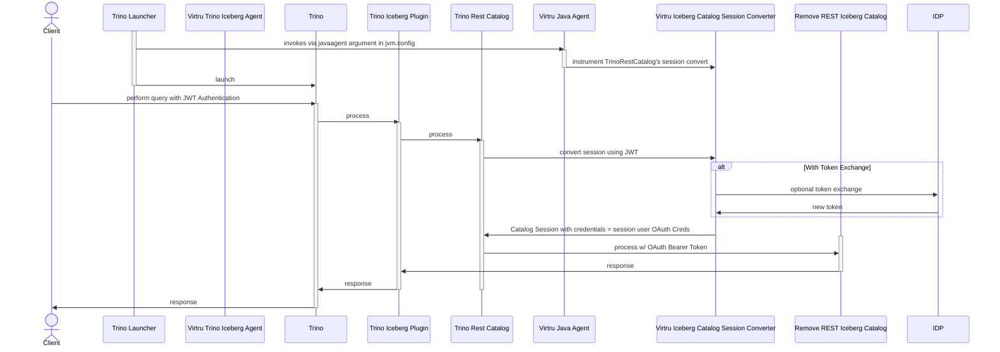

# Trino Iceberg Plugin + JWTAware Header Authentication

A Java Agent that injects JWTAware credentials for use in
Iceberg Rest Catalog authorization within the standard Trino Iceberg Plugin

Prerequisites:
- [Trino header authentication is enabled and configured to use the JWT Header Authenticator](./index.md#header-authentication-configuration)

## Configuration
This agent should be enabled via Trino's jvm.config

Example addition to `jvm.config`:
```
-javaagent:/usr/lib/trino/agent/iceberg-agent.jar
```

### File System Cache

Always enable Trino's [file system cache](https://trino.io/docs/current/object-storage/file-system-cache.html) to enable the per-user metadata caching.  Doing so automatically disables the [iceberg in-memory metadata cache](https://trino.io/docs/current/connector/iceberg.html).  
**WARNING:** If the file-system cache is not enabled, and iceberg in-memory metadata cache is enabled (i.e. `iceberg.metadata-cache.enabled=true`), then the per-user isolation of S3 object reads will NOT work.  The iceberg in-memory metadata cache is per-file and NOT per-user.

```properties
fs.cache.enabled=true
fs.cache.directories=/tmp/trino-cache
fs.cache.max-sizes=1GB

## Note: The iceberg metadata-cache is automatically disabled when `fs.cache.enabled=true`
iceberg.metadata-cache.enabled=false
```

### ABAC Revocation and the Metadata Cache

S4's `iceberg-filter` plugin performs per-user manifest filtering at GET time: when Trino reads
an Iceberg manifest file through S4, the filter rewrites the Avro content to include only the
data file entries the requesting user is entitled to see.

Trino's Alluxio file cache (`fs.cache.enabled=true`) stores this **already-filtered manifest
content** on local disk, keyed per-user. On subsequent queries, Trino reads the manifest bytes
directly from Alluxio's local page store — S4 never receives the request, so `iceberg-filter`
never re-evaluates the user's current entitlements.

**Consequence: revoking a user's Keycloak attributes does not immediately prevent that user from
seeing the data file entries they had access to at the time their manifest was first cached.**

#### Why `fs.cache.ttl` does not bound this window

`fs.cache.ttl` (e.g. `fs.cache.ttl=60s`) sets the age threshold at which a cached entry is
considered expired. However, Alluxio's `LocalCacheManager` does **not** check TTL on reads —
it returns whatever bytes are in the local page store regardless of age. Eviction only happens
when the Alluxio background sweeper thread runs.

The sweeper interval is controlled by the Alluxio property
`alluxio.user.client.cache.ttl.check.interval.seconds`, which defaults to **3600 seconds
(1 hour)** and is not exposed as a configurable `iceberg.properties` setting in Trino.

As a result, the effective maximum time before a revoked user's cached manifest is evicted is
approximately **`fs.cache.ttl` + 1 hour** — not the `fs.cache.ttl` value alone.

#### Forcing immediate enforcement after revocation

The only reliable way to force Trino to re-fetch manifests through S4 immediately is to
**restart the Trino coordinator**, which clears all Alluxio page cache state.

There is no SQL procedure to flush the Alluxio file cache at runtime (Trino 479's Iceberg
connector does not include a `flush_metadata_cache` procedure).

This is a known architectural constraint arising from Iceberg's immutability contract combined
with Alluxio's read-path TTL design. It applies to any Iceberg deployment that performs
server-side per-user metadata filtering, not just this one.

### Implementation: ByteBuddy Instrumentation

The standard Trino Iceberg Connector and associated FileSystem are implemented in a way that
makes it hard to extend using standard Java extension or using overriding via Dependency injection

Therefore, the approach taken uses ByteBuddy's ByteCode library to instrument these modules
to inject TDF extension points and introduces the following components and ByteBuddy based changes:
1. Iceberg Extension Configuration : Configuration of Iceberg Catalog TDF values
2. Iceberg TDF Service: Component injected and used to interact with TDF related services and utilities
3. S3FileSystemModule Delegate to bind the Iceberg TDF Service, Connector Config (TDF) and Iceberg Extension Configuration into the Trino Guice framework 
4. Iceberg Catalog Delegates to perform an STS Web Identity Token Exchange between the Secure Object Proxy and Trino; populate the temporary S3 Credentials for use by the connector for operations against the object store
5. Iceberg Catalog Session Delegate to use the user's JWT as authentication in the standard token exchange between Trino and Catalog instead of the default Token Exchange with a self-minted JWT
6. Delegates to push down Connection Session and Identity to the File System performing operations against the object store. 
7. Delegates to augment S3 Put Operations to populate TDF Data Policy on User Metadata

### Sequence Diagram: Client to Remote Iceberg Rest Catalog with OAuth Token Authorization

